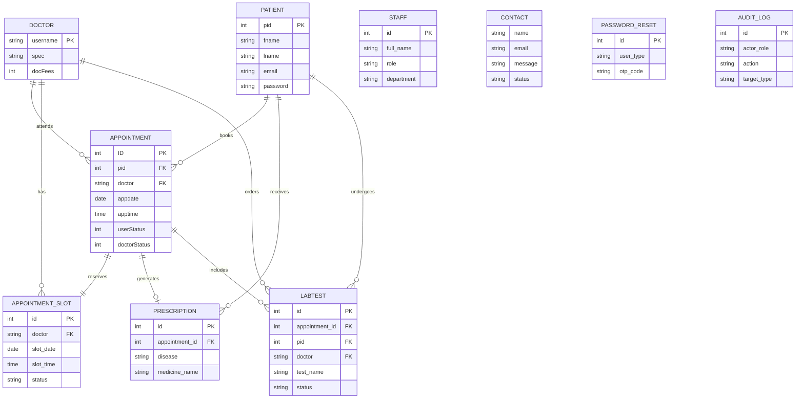

# Hospital Management System - Project Updates & ER Diagram

This document outlines all the major enhancements, bug fixes, and structural changes made to the Hospital Management System, along with a text-based Entity-Relationship (ER) diagram. This information can be directly used for project reports and PowerPoint presentations.

---

## Part 1: Key Project Updates & Enhancements

The following features and fixes were implemented to upgrade the system from its initial state into a secure, production-ready, and user-friendly application:

### 1. Security & Authentication Upgrades
* **Password Hashing:** Upgraded from plaintext passwords to secure Bcrypt hashing (`password_hash` and `password_verify`) for Patients, Doctors, and Admins. Expanded database column lengths (`VARCHAR(255)`) to safely store hashes.
* **CSRF Protection:** Implemented Cross-Site Request Forgery (CSRF) tokens across all forms (`patient-registration.php`, `doctor-auth.php`, etc.) using a centralized `security.php` module to prevent malicious unauthorized submissions.
* **Access Control Guarding:** Introduced strict role-based session checks (`hms_require_role()`) to prevent unauthorized access to dashboards.

### 2. Database Schema Expansions
* **Audit Logging System (`audit_logs`):** Added a system to track critical actions (e.g., `appointment.booked`, `prescription.created`) logging the actor, target, IP address, and metadata.
* **Appointment Slots Management (`appointment_slots`):** Added a dedicated table with unique constraints on (doctor, date, time) to definitively prevent double-booking.
* **Advanced Medical Records:** Introduced `eprescriptiontb` for structured medication records (dosage, duration, instructions) and `labtesttb` for future diagnostic tracking.
* **Secure OTP Reset (`password_reset_tokens`):** Created schema support for secure, time-sensitive password recovery.

### 3. Workflow & Business Logic Fixes
* **Prescription Flow Overhaul:**
  * Fixed a major UX bug where doctors were stuck on `prescribe.php` after submitting a prescription. It now automatically redirects back to the `doctor-dashboard.php#list-pres` tab.
  * Implemented a correlated subquery in the appointment fetching logic. Once a prescription is written, the system detects it and replaces the "Prescribe" button with a green **"Prescribed ✓"** badge and a **View PDF** button.
* **Patient Appointment Locking:** Modified the Patient Dashboard so that patients **cannot cancel** an appointment that has already been consulted/prescribed. The status now correctly shows "Consulted" (Blue badge) instead of just "Confirmed".

### 4. UI/UX & Separation of Concerns
* **Separation of Public vs. Internal Portals:**
  * Cleaned up `index.php` to serve strictly as a frictionless Patient Registration & Login portal. 
  * Extracted the Doctor and Admin login portals into a brand new, secure `staff-login.php` interface, accessible via a subtle "Staff Portal" link in the footer.
* **Dashboard Navigation Fixes:** Resolved overlapping `z-index` and duplicate `sidebarBackdrop` DOM element bugs that were blocking tab clicks in the Doctor Dashboard. Fixed broken JavaScript IIFEs.
* **Dynamic Analytics & Reports:** Replaced static numbers with real-time Chart.js analytics powered by database aggregations (Total Bookings, Average Daily Bookings, and complex graphical reports).
* **Pagination & Advanced Filtering:** Built robust `hms_render_pagination()` and `hms_build_filter_where()` functions to handle large datasets seamlessly. Applied comprehensive filters across all dashboards allowing multi-criteria data slicing.

### 5. New Core Features & Modules (Added in V2)
* **Document Generation:** Implemented robust PDF and Excel export generation for records.
* **Bill Generation System:** Added comprehensive billing capabilities for consultations and procedures.
* **Secure Password Reset Flow:** Fully functioning password recovery utilizing OTP tokens.
* **Expanded Staff Management:** Created a module to onboard and manage hospital staff other than just doctors (e.g., Nurses, Receptionists, Lab Technicians).
* **Department Page:** Introduced a dedicated UI to manage hospital departments and categorize doctors.
* **User Guides:** Added comprehensive Doctors and Patient Guide pages to assist users in navigating the system.
* **Lab Reports Integration:** Integrated structured laboratory testing reports (`labtesttb`) directly into patient records.

---

## Part 2: Text-Based ER (Entity-Relationship) Diagram

Use the following text-based representation to explain the database architecture in your PPT or report.

### Core Entities

1. **PATIENT (`patreg`)**
   * `pid` (Primary Key)
   * `fname`, `lname`, `gender`, `email`, `contact`, `password`

2. **DOCTOR (`doctb`)**
   * `username` (Primary Key)
   * `password`, `email`, `spec` (Specialization), `docFees`

3. **ADMIN (`admintb`)**
   * `username` (Primary Key)
   * `password`, `email`

4. **APPOINTMENT (`appointmenttb`)**
   * `ID` (Primary Key)
   * `pid` (Foreign Key -> patreg)
   * `doctor` (Foreign Key -> doctb)
   * `appdate`, `apptime`, `docFees`, `userStatus`, `doctorStatus`

5. **PRESCRIPTION (`prestb` & `eprescriptiontb`)**
   * `ID` (Foreign Key -> appointmenttb)
   * `pid` (Foreign Key -> patreg)
   * `doctor` (Foreign Key -> doctb)
   * `disease`, `allergy`, `prescription_notes`, `medicine_name`, `dosage`

6. **APPOINTMENT SLOT (`appointment_slots`)**
   * `id` (Primary Key)
   * `doctor` (Foreign Key -> doctb)
   * `slot_date`, `slot_time`, `status`, `appointment_id`

7. **AUDIT LOG (`audit_logs`)**
   * `id` (Primary Key)
   * `actor_role`, `actor_id`, `action`, `target_type`, `created_at`

8. **CONTACT MESSAGES (`contact`)**
   * `name`, `email`, `contact`, `message`, `status`, `created_at`

9. **STAFF DIRECTORY (`stafftb`)**
   * `id` (Primary Key)
   * `full_name`, `role`, `department`, `email`, `phone`, `status`, `created_at`

10. **LAB TESTS (`labtesttb`)**
    * `id` (Primary Key)
    * `appointment_id` (Foreign Key -> appointmenttb)
    * `pid` (Foreign Key -> patreg)
    * `doctor` (Foreign Key -> doctb)
    * `test_name`, `result_value`, `status`, `ordered_at`

11. **PASSWORD RESET TOKENS (`password_reset_tokens`)**
    * `id` (Primary Key)
    * `user_type`, `user_identifier`, `otp_code`, `expires_at`, `consumed_at`
### Relationships (Cardinality)

* **PATIENT (1) ----- (N) APPOINTMENT**
  * *A patient can book multiple appointments over time.*
* **DOCTOR (1) ----- (N) APPOINTMENT**
  * *A doctor handles multiple appointments.*
* **DOCTOR (1) ----- (N) APPOINTMENT_SLOTS**
  * *A doctor has a schedule consisting of many time slots.*
* **APPOINTMENT_SLOT (1) ----- (1) APPOINTMENT**
  * *Each booked appointment occupies exactly one time slot.*
* **APPOINTMENT (1) ----- (0 or 1) PRESCRIPTION**
  * *An appointment can have one prescription generated after the consultation is complete.*

---

### Mermaid ER Diagram (Optional, for auto-generating charts)
If your report/PPT software supports Mermaid.js, you can paste this block to render a visual chart:

